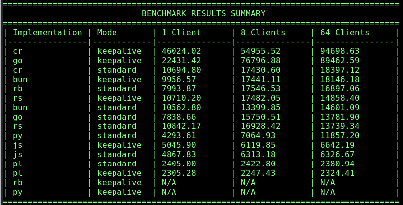

# native-httpd-performance
Performance comparison of basic httpd implementations provided by various languages

for each implementation in a given language, we have two files - a server launch script and the server itself. The test script looks for all server launch scripts of the form "run-httpd.<lang>", which starts the server in that language.

for instance, the perl launch script is called "run-httpd.pl" and it launches the server, which is called "server.pl"

For compiled languages, the launch script compiles the program and runs it. 

For the example of the go language, the launch script is called "run-httpd.go" and it compiles and launches its server, which is called "server_go"

# running the tests

The test.sh script runs each launch script, which compiles, if neccesary, and runs the server.

When all the tests are run, the test script displays the sorted performance of the implementations.

