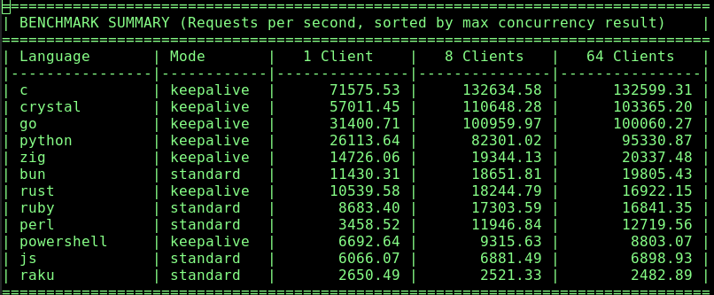

# native-httpd-performance
Performance comparison of basic httpd implementations provided by various languages

# running the tests

These scripts do the work:

* build.sh - this compiles whetever needs compiling
* bench.sh - this runs the benchmark tests
* show-results.sh - this shows the results
* cleanup.sh - this brings us back to square one

This benchmark is initially focused on latency, which, in addition to the underlying OS, is determined by the characteristics of the language:

* Compiled vs Interpreted - this is the biggest factor
* Concurrency Model (event-driven vs thread-per-request)
* Memory Management and Garbage Collection (GC) - This can cause sudden random latency spikes
* Runtime Context Switching - How this is implemented determines efficiency and scalability
* Global Interpreter Lock (GIL) - Languages using a global lock are less effective w/ multiple CPUs

And of the httpd server code:

* Event Loop vs. Thread Pool - Event loops can scale better than thread pools
* Lock Contention - Poorly designed algorithms can suffer from this, leaving cores idle
* Keep-Alive Handling - Can it use keepalive to bypass the 3-way TCP handshake for subsequent requests?

# adding new implementations

New implementations in different languages are welcomed. They just need to be organized in the same way as the existing ones, so that the scripts can detect and run them.

If your chosen language includes an http implementation by default, you can simply use that, or if you prefer, you can implement an http server from lower level building blocks. Of course, many languages do not include an http library, and a lower level approach is the order of the day.
